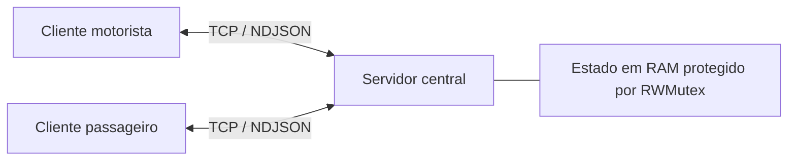

# VaiJunto — Sistema de Caronas Compartilhadas

Projeto desenvolvido para o Problema 1 da disciplina TEC502 — Concorrência e Conectividade, utilizando a metodologia PBL.

O VaiJunto permite que motoristas publiquem caronas e que passageiros reservem viagens com um ou mais trechos. Um itinerário pode combinar caronas de motoristas diferentes, desde que as cidades e os horários permitam a conexão.

## Sumário

- [Especificações da aplicação](#especificações-da-aplicação)
- [Estrutura do projeto](#estrutura-do-projeto)
- [Manual de uso](#manual-de-uso)
- [Execução com Docker](#execução-com-docker)
- [Acesso por outro computador](#acesso-por-outro-computador)
- [Exemplo de utilização](#exemplo-de-utilização)
- [Testes automatizados](#testes-automatizados)
- [Protocolo de comunicação](#protocolo-de-comunicação)
- [Problemas comuns](#problemas-comuns)

## Especificações da aplicação

A aplicação utiliza Go e sua biblioteca padrão. A comunicação é feita por sockets TCP, com mensagens JSON delimitadas por quebra de linha (NDJSON). Não são utilizados HTTP, REST, RPC, gRPC ou bancos de dados externos.

O sistema possui três componentes principais:

| Componente | Função |
| :--- | :--- |
| Servidor central | Mantém usuários, sessões, caronas, reservas e notificações em RAM |
| Cliente motorista | Permite publicar caronas, consultar passageiros e cancelar caronas ou trechos |
| Cliente passageiro | Permite buscar itinerários, confirmar e cancelar reservas e consultar notificações |



As cidades são representadas como vértices de um multigrafo direcionado, e os trechos são suas arestas. Duas ofertas com a mesma rota possuem IDs e disponibilidades independentes. O motorista informa o valor por quilômetro e a distância de cada trecho, e o servidor calcula seu preço.

As vagas são controladas por trecho. O passageiro não escolhe um número de assento na interface; a atribuição é automática. A reserva é atômica: todos os trechos são confirmados juntos ou nenhum é reservado. O servidor utiliza `sync.RWMutex` para proteger as consultas e alterações do estado.

> **Estado em memória:** encerrar ou reiniciar o servidor apaga os cadastros, sessões, caronas, reservas e notificações. Fechar apenas um cliente não apaga esses dados.

## Estrutura do projeto

| Pasta ou arquivo | Conteúdo |
| :--- | :--- |
| `cmd/servidor` | Inicialização do servidor TCP |
| `cmd/cliente_motorista` | Inicialização do cliente motorista |
| `cmd/cliente_passageiro` | Inicialização do cliente passageiro |
| `cmd/carga` | Programa para simular vários clientes concorrentes |
| `internal/servidor` | Grafo, reservas, autenticação, roteamento e atendimento TCP |
| `internal/cliente` | Menus, entrada de dados e comunicação dos clientes |
| `internal/configuracao/rede.go` | IP padrão dos clientes e endereço de escuta do servidor |
| `internal/protocolo` | Estruturas das mensagens, validações e documentação do protocolo |
| `internal/carga` | Execução e medição do teste de carga |
| `testes` | Testes de integração, concorrência e falhas |
| `exemplos` | Arquivos JSON para enviar operações pelo terminal |
| `Dockerfile` | Etapas de testes, compilação e montagem da imagem |
| `compose.yaml` | Configuração dos serviços e da porta do servidor |

## Manual de uso

### Requisitos

Para executar diretamente no computador:

- Go 1.27.0 ou superior, conforme o `go.mod`;
- Windows ou Linux;
- Código completo do projeto;
- Porta TCP 8080 disponível, ou outra porta configurada.

Confira a instalação:

```bash
go version
```

Baixe e extraia o projeto ou clone seu repositório. Abra a pasta que contém `go.mod` e `compose.yaml`. Todos os comandos deste manual devem ser executados nessa pasta. No VS Code, utilize **Arquivo > Abrir Pasta** e **Terminal > Novo Terminal**.

### 1. Iniciar o servidor

Os clientes e o teste de carga executados com Go apontam por padrão para **192.168.1.5:8080**, o IP Ethernet da máquina usada nesta configuração. Se outra máquina for hospedar o servidor, ajuste o endereço conforme a seção abaixo antes de abrir os clientes.

No primeiro terminal:

```bash
go run ./cmd/servidor
```

O servidor escuta na porta 8080. Mantenha esse terminal aberto enquanto utiliza os clientes.

### 2. Iniciar o cliente motorista

Em outro terminal:

```bash
go run ./cmd/cliente_motorista
```

Escolha **2 - Criar conta**, informe nome, e-mail e senha e, depois, escolha **1 - Entrar**. O cadastro feito nesse cliente recebe o perfil de motorista.

| Opção | Ação |
| :---: | :--- |
| 1 | Publicar carona |
| 2 | Minhas caronas e passageiros |
| 3 | Cancelar carona |
| 4 | Trocar de conta |
| 5 | Cancelar trecho |
| 0 | Sair |

Na publicação, informe a sequência de cidades, data, horário, vagas, valor por quilômetro, distância e tempos de cada trecho. Confira o resumo e confirme a publicação.

### 3. Iniciar o cliente passageiro

Em um terceiro terminal:

```bash
go run ./cmd/cliente_passageiro
```

Crie uma conta com outro e-mail e entre. O cadastro feito nesse cliente recebe o perfil de passageiro.

| Opção | Ação |
| :---: | :--- |
| 1 | Buscar e reservar itinerário |
| 2 | Minhas reservas |
| 3 | Cancelar reserva |
| 4 | Trocar de conta |
| 5 | Verificar notificações |
| 0 | Sair |

Para reservar, informe origem, destino, data e critério de ordenação. Escolha um dos itinerários apresentados e confirme. A busca não bloqueia vagas: a disponibilidade é verificada novamente na confirmação.

### Entrada de dados e cancelamentos

- As datas no menu aceitam `DD/MM/AAAA` ou `AAAA-MM-DD`. O horário utiliza `HH:MM`, com fuso `-03:00` na publicação pelo menu.
- A partida precisa estar no futuro. Use uma data futura também nos arquivos de exemplo.
- A senha precisa ter pelo menos oito caracteres. Os caracteres digitados ficam visíveis no terminal.
- Digite `/voltar` em um formulário para retornar ao menu.
- O passageiro pode cancelar sua reserva antes do início do itinerário, devolvendo as vagas de todos os trechos.
- O motorista não pode cancelar uma carona ou um de seus trechos após o início da carona.
- Se um passageiro já iniciou A–B, o motorista da conexão B–C não pode cancelar o trecho utilizado nessa reserva. O início é determinado pelo horário programado.
- Quando um cancelamento do motorista é permitido, as reservas afetadas são canceladas por inteiro. As vagas são devolvidas, mas os trechos cancelados continuam indisponíveis para novas reservas.
- Os avisos são consultados ao retornar ao menu do passageiro ou pela opção **Verificar notificações**. Não há envio espontâneo do servidor ao cliente.

Para encerrar, escolha **0 - Sair** nos clientes e pressione `Ctrl+C` no terminal do servidor.

### Onde alterar o IP do servidor

Abra [internal/configuracao/rede.go](internal/configuracao/rede.go) e altere a constante:

```go
const ServidorPadrao = "192.168.1.5:8080"
```

Substitua `192.168.1.5` pelo IPv4 do computador que executará o servidor. No Windows, descubra o endereço com `ipconfig`; no Linux, com `hostname -I`. Se os clientes e o servidor forem executados somente no mesmo computador, também pode usar `127.0.0.1:8080`.

A constante `EscutaPadrao = ":8080"` permite ao servidor receber conexões em todas as interfaces. Ela não precisa receber o IP de cada computador. Quando o IP da rede mudar, atualize o destino dos clientes.

Sem editar arquivos, também é possível informar o destino ao abrir cada cliente:

```bash
go run ./cmd/cliente_motorista -servidor 192.168.1.5:8080
go run ./cmd/cliente_passageiro -servidor 192.168.1.5:8080
```

Abra esses comandos em terminais separados. A flag `-servidor` tem prioridade sobre `VAIJUNTO_SERVIDOR`, que tem prioridade sobre a constante. No Docker Compose, a variável definida pelo serviço continua usando `servidor:8080` por padrão, permitindo executar o conjunto em outro computador sem editar o código. Para acessar um servidor remoto pelo Docker, defina `VAIJUNTO_SERVIDOR` conforme a seção de acesso por outro computador.

Depois de editar a constante, execute novamente com `go run` ou recompile seus executáveis. Se utiliza a imagem Docker, reconstrua-a para incluir alterações do código.

### Alterar a porta na execução local

Exemplo utilizando a porta 9000, em terminais separados:

```bash
go run ./cmd/servidor -endereco :9000
```

```bash
go run ./cmd/cliente_motorista -servidor 127.0.0.1:9000
```

```bash
go run ./cmd/cliente_passageiro -servidor 127.0.0.1:9000
```

## Execução com Docker

É necessário ter Docker em funcionamento, com suporte a contêineres Linux e ao comando `docker compose`. No Windows, abra o Docker Desktop antes de executar os comandos. Não é necessário instalar Go no computador quando toda a execução ocorre em contêineres.

Confira o ambiente:

```bash
docker version
docker compose version
```

### 1. Construir a imagem e iniciar o servidor

Na raiz do projeto:

```bash
docker compose build
docker compose up -d servidor
```

A primeira construção precisa de acesso à internet para baixar a imagem base. O Dockerfile executa os testes com `-race` e o `go vet`, compila os programas e gera a imagem local `vaijunto:local`. Se uma etapa falhar, a construção é interrompida.

Confira o servidor:

```bash
docker compose ps
docker compose logs servidor
```

### 2. Abrir os clientes

Em um terminal:

```bash
docker compose run --rm motorista
```

Em outro terminal:

```bash
docker compose run --rm passageiro
```

Os menus são os mesmos da execução com Go. Cada comando `run` cria um contêiner cliente; `--rm` remove esse contêiner quando o programa termina. É possível abrir mais terminais para executar outros clientes.

Por padrão, os clientes do Compose usam `servidor:8080`. Esse nome identifica o serviço na rede local do Compose. O mapeamento `8080:8080` permite acessar o servidor pela porta 8080 do computador, conforme o funcionamento de [redes e portas do Compose](https://docs.docker.com/compose/how-tos/networking/).

Se a variável `VAIJUNTO_SERVIDOR` foi definida anteriormente para outro computador, remova-a antes de voltar ao servidor local do Compose.

No PowerShell:

```powershell
Remove-Item Env:VAIJUNTO_SERVIDOR -ErrorAction SilentlyContinue
```

No Linux:

```bash
unset VAIJUNTO_SERVIDOR
```

### 3. Encerrar ou atualizar

Saia dos menus dos clientes. Para encerrar o servidor e remover os recursos do Compose:

```bash
docker compose down
```

Depois de alterar o código, reconstrua e atualize o servidor:

```bash
docker compose build
docker compose up -d servidor
```

A reinicialização do processo servidor perde os dados mantidos em RAM, inclusive quando acontece dentro do contêiner.

### Porta 8080 ocupada no computador

O Compose permite alterar apenas a porta publicada no computador. No PowerShell:

```powershell
$env:VAIJUNTO_PORTA = "9000"
docker compose up -d servidor
```

No Linux:

```bash
export VAIJUNTO_PORTA=9000
docker compose up -d servidor
```

Nesse caso, clientes externos usam `IP_DO_SERVIDOR:9000`. Os clientes na mesma rede Compose continuam usando `servidor:8080`, pois a porta interna não mudou.

## Acesso por outro computador

Utilize um único computador como servidor central. Os demais executam os clientes e acessam o IP desse computador. Para a demonstração no laboratório, os computadores devem estar em uma rede que permita comunicação entre eles; redes de visitantes podem bloquear esse acesso.

### Computador 1: servidor

Com o projeto e Docker disponíveis:

```bash
docker compose build
docker compose up -d servidor
```

Descubra o IP da interface conectada à rede do laboratório.

No Windows:

```powershell
ipconfig
```

No Linux:

```bash
hostname -I
```

Escolha o IPv4 da rede local, evitando endereços das interfaces virtuais do Docker. Nos próximos exemplos, `192.168.1.10` representa esse IP e deve ser substituído pelo endereço real.

A máquina do servidor precisa permitir conexões de entrada na porta TCP 8080 pelo firewall da rede utilizada.

### Computador 2: clientes em Docker

Copie o projeto para esse computador, abra sua pasta e construa a imagem:

```bash
docker compose build
```

Não inicie outro serviço `servidor`: os clientes devem usar o estado central do computador 1.

No PowerShell:

```powershell
$env:VAIJUNTO_SERVIDOR = "192.168.1.10:8080"
docker compose run --rm passageiro
```

No Linux:

```bash
export VAIJUNTO_SERVIDOR=192.168.1.10:8080
docker compose run --rm passageiro
```

Para abrir o motorista, repita a definição da variável em outro terminal e execute:

```bash
docker compose run --rm motorista
```

A variável definida dessa forma vale para aquele terminal. Use o IP da máquina do servidor, não `localhost` nem o IP interno do contêiner. A porta publicada encaminha a conexão recebida pela máquina para o servidor no contêiner.

### Cliente remoto sem Docker

Se o segundo computador tiver Go instalado, também pode acessar o mesmo servidor com:

```bash
go run ./cmd/cliente_passageiro -servidor 192.168.1.10:8080
```

```bash
go run ./cmd/cliente_motorista -servidor 192.168.1.10:8080
```

Para verificar se a porta está acessível a partir de um cliente Windows:

```powershell
Test-NetConnection 192.168.1.10 -Port 8080
```

O campo `TcpTestSucceeded` deve ser `True`. Esse teste verifica a conexão TCP; o funcionamento da aplicação deve ser conferido pelos menus.

## Exemplo de utilização

Com o servidor em execução, cadastre dois motoristas com e-mails diferentes e um passageiro. Use a mesma data futura nas duas ofertas abaixo. As distâncias e os tempos são valores fictícios para a demonstração.

| Campo | Motorista Ana | Motorista Bruno |
| :--- | :--- | :--- |
| Rota | Salvador → Feira de Santana | Feira de Santana → Serrinha |
| Partida | 08:00 | 10:30 |
| Vagas | 2 | 2 |
| Valor por km | R$ 0,50 | R$ 0,50 |
| Distância | 100 km | 80 km |
| Tempo de viagem | 120 minutos | 60 minutos |
| Parada | 15 minutos | 0 minutos |
| Preço calculado | R$ 50,00 | R$ 40,00 |

1. Publique as duas caronas nos respectivos clientes motorista.
2. No passageiro, busque Salvador → Serrinha na data escolhida.
3. Selecione o itinerário com os dois motoristas. O preço total é R$ 90,00 e a duração é de 3h30, incluindo a espera.
4. Confirme a reserva e consulte as caronas dos motoristas. Cada trecho passa a ter uma vaga disponível.
5. Cancele a reserva no passageiro e consulte novamente. Cada trecho volta a ter duas vagas.
6. Faça outra reserva e cancele um dos trechos pelo motorista, antes do início. Consulte o aviso e a reserva cancelada no passageiro.

Se a busca não apresentar o itinerário, confira data, horários, vagas e se a partida ainda está no futuro.

## Testes automatizados

### Testes locais

Na raiz do projeto:

```bash
go test -count=1 ./...
go vet ./...
```

Para mostrar os nomes dos testes e seus resultados:

```bash
go test -count=1 -v ./...
```

Os testes incluem disputa pela última vaga, atomicidade de itinerários, cancelamentos, notificações, validação de mensagens, comunicação TCP e recuperação de uma confirmação cuja resposta foi perdida. Eles criam seus próprios servidores e dados quando necessário; não exigem que o servidor da demonstração esteja aberto.

Para utilizar o detector de condições de corrida:

```bash
go test -race -count=1 ./...
```

O comando com `-race` exige uma plataforma compatível, CGO habilitado e um compilador C compatível instalado. O estágio de testes do Dockerfile já configura `CGO_ENABLED=1`.

Para executar a etapa de testes do Docker sem reutilizar seu cache:

```bash
docker build --no-cache --target testes -t vaijunto:testes .
```

### Teste de carga

Este teste precisa de um servidor ativo. Ele cria usuários e uma oferta de dois trechos para simular a disputa pelas vagas.

Na execução local:

```bash
go run ./cmd/carga -clientes 100 -vagas 5
```

Para um servidor em outro computador:

```bash
go run ./cmd/carga -servidor 192.168.1.10:8080 -clientes 100 -vagas 5
```

No Docker, com o endereço definido conforme o ambiente:

```bash
docker compose run --rm carga
```

Para mudar a quantidade de clientes e vagas no Docker:

```bash
docker compose run --rm carga -clientes 50 -vagas 3
```

O programa aceita de 1 a 200 clientes e de 1 a 100 vagas por trecho. A saída JSON apresenta confirmações, recusas, erros de transporte, duração, latência média, latência p95, requisições por segundo e integridade.

Com 100 clientes e cinco vagas, em uma execução sem falhas, o resultado esperado é cinco confirmações, 95 recusas, zero erros de transporte e `integridade: true`. Os tempos e a vazão devem ser obtidos na execução, pois dependem da máquina e da rede. A medição de carga corresponde à fase concorrente de confirmação, não à preparação dos cadastros.

## Protocolo de comunicação

A documentação das mensagens e operações está em [internal/protocolo/PROTOCOLO.md](internal/protocolo/PROTOCOLO.md).

Cada requisição é um objeto JSON em uma linha, terminado por `\n`, com `acao`, `token` quando necessário e `dados`. O servidor responde com `status`, `mensagem` e, quando aplicável, `dados`.

Exemplo de consulta de reservas:

```json
{"acao":"CONSULTAR_RESERVAS","token":"TOKEN_DA_SESSAO","dados":{}}
```

O cliente abre uma conexão TCP por operação. A sessão é identificada pelo token, e não pela permanência do socket. Publicações e confirmações utilizam uma chave para permitir a repetição da mesma operação bem-sucedida sem criar outro recurso.

### Utilizar os arquivos de exemplo

Os arquivos em `exemplos/` contêm apenas o objeto `dados`, e não o envelope completo. São opcionais: os menus já montam as requisições.

Com o servidor ativo, é possível cadastrar e autenticar um motorista assim:

```bash
go run ./cmd/cliente_motorista -acao CADASTRAR -arquivo exemplos/cadastro_motorista.json
go run ./cmd/cliente_motorista -acao AUTENTICAR -arquivo exemplos/login_motorista.json
```

Copie o token retornado na autenticação e utilize-o nas operações seguintes:

```bash
go run ./cmd/cliente_motorista -acao CONSULTAR_CARONAS -token "TOKEN_RETORNADO"
```

Antes de usar `publicar.json`, ajuste sua data para uma partida futura. Nos exemplos de reserva e cancelamento, substitua os IDs pelos valores retornados pelo seu servidor. Para criar outra publicação com dados diferentes, use outra chave. Os exemplos não são carregados automaticamente na inicialização.

## Problemas comuns

| Problema | O que verificar |
| :--- | :--- |
| `go` não reconhecido ou versão incompatível | Instalação do Go e versão exigida pelo `go.mod` |
| Docker não conecta ao daemon | Docker Desktop ou serviço Docker em execução |
| Porta já em uso | Outro servidor ativo; encerre-o ou configure outra porta |
| Conexão recusada | Servidor iniciado, endereço correto e porta publicada |
| Timeout ao acessar outro computador | IP, firewall e isolamento entre dispositivos na rede |
| Nenhum itinerário encontrado | Data, partida futura, vagas e compatibilidade dos horários |
| Cadastro com e-mail já existente | Entre na conta existente ou use outro e-mail para o outro perfil |
| Token inválido ou expirado | Entre novamente; reiniciar o servidor também invalida as sessões |
| Dados desapareceram | O processo servidor foi encerrado ou reiniciado; o estado é somente em RAM |
| Erro ao repetir uma chave com outros dados | Use nova chave para uma nova operação |

A configuração de Docker descreve como reproduzir a execução. A demonstração distribuída deve ser conferida com servidor e clientes nos computadores físicos do laboratório.
