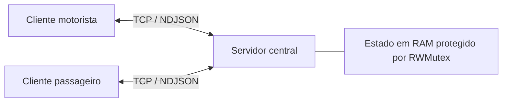

# VaiJunto — Sistema de Caronas Compartilhadas

Projeto criado para o Problema 1 da disciplina TEC502 — Concorrência e Conectividade, usando a metodologia PBL.

O VaiJunto permite que motoristas ofereçam caronas e passageiros reservem viagens com um ou mais trechos. Um itinerário pode combinar caronas de diferentes motoristas, desde que as cidades e os horários sejam compatíveis.

## Sumário

- [Especificações da aplicação](#especificações-da-aplicação)
- [Estrutura do projeto](#estrutura-do-projeto)
- [Como o sistema funciona](#como-o-sistema-funciona)
- [Teste em computadores distintos](#teste-em-computadores-distintos)
- [Manual de uso](#manual-de-uso)
- [Execução com Docker](#execução-com-docker)
- [Acesso por outro computador](#acesso-por-outro-computador)
- [Exemplo de utilização](#exemplo-de-utilização)
- [Testes automatizados](#testes-automatizados)
- [Protocolo de comunicação](#protocolo-de-comunicação)
- [Problemas comuns](#problemas-comuns)

## Especificações da aplicação

A aplicação usa Go e sua biblioteca padrão. A comunicação acontece por sockets TCP, com mensagens JSON delimitadas por quebra de linha (NDJSON). Não são usados HTTP, REST, RPC, gRPC ou bancos de dados externos.

| Componente | Função |
| :--- | :--- |
| Servidor central | Armazena usuários, sessões, caronas, reservas e notificações na memória |
| Cliente motorista | Permite publicar caronas, consultar passageiros e cancelar caronas ou trechos |
| Cliente passageiro | Permite buscar itinerários, confirmar e cancelar reservas e consultar notificações |



As cidades são vértices de um multigrafo direcionado, e os trechos são suas arestas. Duas ofertas com a mesma rota possuem IDs e disponibilidades independentes. O motorista escolhe diretamente o preço por passageiro de cada trecho. A distância continua sendo informada, mas não determina o preço.

As vagas são controladas por trecho. O passageiro não escolhe um número de assento; a atribuição é automática. A reserva é atômica: todos os trechos são confirmados juntos ou nenhum é reservado. O servidor usa `sync.RWMutex` para proteger consultas e alterações do estado.

> **Estado em memória:** encerrar ou reiniciar o servidor apaga cadastros, sessões, caronas, reservas e notificações. Fechar apenas um cliente não apaga esses dados.

## Estrutura do projeto

| Pasta ou arquivo | Conteúdo |
| :--- | :--- |
| `cmd/servidor` | Inicialização do servidor TCP |
| `cmd/cliente_motorista` | Inicialização do cliente motorista |
| `cmd/cliente_passageiro` | Inicialização do cliente passageiro |
| `cmd/carga` | Programa para simular vários clientes concorrentes |
| `internal/servidor` | Grafo, reservas, autenticação, roteamento e atendimento TCP |
| `internal/cliente` | Menus, entrada de dados e comunicação dos clientes |
| `internal/configuracao/rede.go` | Endereços padrão de cliente e servidor |
| `internal/protocolo` | Estruturas, validações e documentação do protocolo |
| `internal/carga` | Execução e medição do teste de carga |
| `testes` | Testes de integração, concorrência e falhas |
| `Dockerfile` | Testes, compilação e montagem da imagem |
| `compose.yaml` | Serviços e publicação da porta do servidor |

## Como o sistema funciona

### TCP e separação de responsabilidades

O TCP fornece entrega ordenada de bytes, mas não delimita mensagens. Por isso cada objeto JSON termina com uma quebra de linha. O protocolo define as estruturas; o transporte cuida dos sockets e prazos; o roteador valida as mensagens; o gerenciador aplica as regras; os clientes apresentam os menus. Não há chamadas HTTP/RPC nem acesso direto dos clientes ao estado.

O servidor atende cada conexão em uma goroutine, até 256 conexões simultâneas. Mensagens da mesma conexão são sequenciais. O prazo de leitura/escrita evita que conexões ociosas ocupem recursos indefinidamente; ele não é um limite de duração do algoritmo de busca. As travas do estado são liberadas antes do envio da resposta pela rede.

### Reserva atômica e escolha da trava global

O estado compartilhado usa um único `sync.RWMutex`. Na confirmação, o servidor adquire a trava exclusiva, valida **todos** os trechos e escolhe as vagas antes de modificar qualquer um deles. Somente após todas as verificações registra a reserva e ocupa as vagas. Uma falha de validação deixa todos os trechos intactos. Cancelamentos e devoluções de vagas também acontecem sob essa trava.

Essa escolha simplifica a consistência entre caronas, reservas, vagas e notificações e evita ciclos de aquisição de travas por trecho. O custo é serializar alterações mesmo em rotas independentes; não é uma solução de máxima escalabilidade nem oferece ordem de atendimento FIFO. Uma alternativa futura seria usar travas por recurso em ordem fixa, com maior complexidade para reservas que atravessam várias caronas.

Consultas usam a trava de leitura. A busca copia os trechos disponíveis sob essa trava e explora a cópia depois de liberá-la. Assim, uma busca não bloqueia alterações durante toda a exploração, mas seu resultado pode ficar desatualizado: a confirmação sempre revalida as vagas. Buscar não significa reservar.

### Multigrafo e busca limitada

Cada cidade é um vértice e cada trecho publicado é uma aresta direcionada independente. Isso preserva ofertas paralelas de vários motoristas. A busca em profundidade (DFS) combina arestas respeitando vagas, cidades, horários e ausência de ciclos; não é um algoritmo de menor caminho com garantia irrestrita de ótimo.

Para controlar o crescimento combinatório, a busca examina no máximo 50000 arestas, encontra até 100 itinerários e usa no máximo 12 trechos por padrão (configurável de 1 a 20). Quando a exploração é limitada, a resposta informa `limitada: true`. A ordenação pelo horário de partida do primeiro trecho vale para os caminhos encontrados; nesse caso, não garante a melhor opção entre todos os caminhos possíveis.

O preço de cada trecho é escolhido pelo motorista, com até duas casas decimais; o total da reserva é somado em centavos. A duração vai da primeira partida até a chegada final, incluindo esperas nas conexões. Paradas são informadas somente nas cidades intermediárias de cada carona: a última cidade encerra o percurso e sempre tem parada zero, inclusive para ofertas recebidas de clientes antigos.

### Falhas, repetição e limites da solução

Publicações e confirmações usam uma chave de idempotência por usuário e operação. Se a conexão cair depois da execução, repetir os mesmos dados e a mesma chave não duplica o recurso. Isso não é persistência: reiniciar o servidor perde o estado e as chaves. Também não há replicação, tolerância à queda do servidor central ou criptografia TLS no transporte; use senhas de demonstração.

Os testes automatizados verificam regras, protocolo, concorrência, atomicidade e falhas. O programa de carga cria vários passageiros simulados para disputar as mesmas vagas e apresenta confirmações, recusas, latência e integridade ao final.

## Teste em computadores distintos

O sistema foi testado em computadores distintos na mesma rede local. O servidor ficou disponível pelo seu endereço IP e porta TCP, enquanto os clientes motorista e passageiro se conectaram a ele a partir de outras máquinas.

Essa execução confirma que a comunicação acontece pela rede usando TCP/IP, e não depende de os programas estarem no mesmo computador. As instruções para repetir a configuração estão na seção [Acesso por outro computador](#acesso-por-outro-computador).

## Manual de uso

### Requisitos

- Go 1.27.0 ou mais recente, conforme o `go.mod`;
- Windows ou Linux;
- código completo do projeto;
- porta TCP 8080 disponível, ou outra porta configurada.

Verifique a instalação:

```bash
go version
```

Abra a pasta que contém `go.mod` e `compose.yaml`. Todos os comandos deste manual devem ser executados nessa pasta.

### 1. Iniciar o servidor

No primeiro terminal:

```bash
go run ./cmd/servidor
```

O servidor escuta na porta 8080. Mantenha o terminal aberto enquanto usa os clientes.

### 2. Iniciar o cliente motorista

Em outro terminal:

```bash
go run ./cmd/cliente_motorista
```

Escolha **2 - Criar conta** e informe nome, e-mail e senha. Após o cadastro, o acesso é realizado automaticamente e o menu do motorista é exibido.

| Opção | Ação |
| :---: | :--- |
| 1 | Publicar carona |
| 2 | Minhas caronas e passageiros |
| 3 | Cancelar carona |
| 4 | Trocar de conta |
| 5 | Cancelar trecho |
| 0 | Sair |

### 3. Iniciar o cliente passageiro

Em um terceiro terminal:

```bash
go run ./cmd/cliente_passageiro
```

Crie uma conta usando outro e-mail. O acesso é realizado automaticamente e o menu do passageiro é exibido.

| Opção | Ação |
| :---: | :--- |
| 1 | Buscar e reservar itinerário |
| 2 | Minhas reservas |
| 3 | Cancelar reserva |
| 4 | Trocar de conta |
| 5 | Verificar notificações |
| 0 | Sair |

### Entrada de dados e cancelamentos

- As datas aceitam `DD/MM/AAAA` ou `AAAA-MM-DD`.
- O horário usa `HH:MM`, com fuso `-03:00` na publicação pelo menu.
- A partida precisa estar no futuro.
- A senha precisa ter pelo menos oito caracteres e fica visível no terminal.
- Digite `/voltar` em um formulário para retornar ao menu.
- O passageiro pode cancelar sua reserva antes do início do itinerário.
- O motorista não pode cancelar uma carona ou trecho após o início da carona.
- Em A → B → C com dois motoristas, o motorista de B → C também não pode cancelar sua carona ou trecho a partir do início de A → B. Se cancelar antes desse início, a reserva inteira A → B → C é cancelada, as vagas de ambos os trechos são devolvidas e o passageiro recebe uma notificação. A oferta A → B do primeiro motorista continua disponível para outras reservas.
- Cancelamentos feitos pelo motorista cancelam por inteiro as reservas afetadas e devolvem suas vagas.
- As notificações são consultadas no menu do passageiro; não há envio espontâneo do servidor.

Para encerrar, escolha **0 - Sair** nos clientes e pressione `Ctrl+C` no terminal do servidor.

### Configurar o endereço do servidor

O endereço padrão está em [internal/configuracao/rede.go](internal/configuracao/rede.go):

```go
const ServidorPadrao = "192.168.0.67:8080"
const EscutaPadrao = ":8080"
```

Você também pode informar o endereço sem editar o código:

```bash
go run ./cmd/cliente_motorista -servidor 192.168.1.5:8080
go run ./cmd/cliente_passageiro -servidor 192.168.1.5:8080
```

A flag `-servidor` tem prioridade sobre `VAIJUNTO_SERVIDOR`, que tem prioridade sobre a constante.

### Alterar a porta local

Em terminais separados:

```bash
go run ./cmd/servidor -endereco :9000
go run ./cmd/cliente_motorista -servidor 127.0.0.1:9000
go run ./cmd/cliente_passageiro -servidor 127.0.0.1:9000
```

## Execução com Docker

É necessário ter Docker em funcionamento e suporte ao comando `docker compose`. No Windows, abra o Docker Desktop antes de executar os comandos. Não é necessário instalar Go quando toda a execução ocorre em contêineres.

Verifique o ambiente:

```bash
docker version
docker compose version
```

### 1. Construir a imagem e iniciar o servidor

```bash
docker compose build
docker compose up -d servidor
```

O Dockerfile executa os testes com `-race`, executa `go vet`, compila os programas e gera a imagem `vaijunto:local`.

Confira o servidor:

```bash
docker compose ps
docker compose logs servidor
```

### 2. Abrir os clientes

Em terminais separados:

```bash
docker compose run --rm motorista
```

```bash
docker compose run --rm passageiro
```

Por padrão, os clientes usam `servidor:8080`, nome disponível somente na rede local do Compose.

Se `VAIJUNTO_SERVIDOR` foi definido para outro computador, remova a variável antes de voltar ao servidor local.

PowerShell:

```powershell
Remove-Item Env:VAIJUNTO_SERVIDOR -ErrorAction SilentlyContinue
```

Linux:

```bash
unset VAIJUNTO_SERVIDOR
```

### 3. Encerrar ou atualizar

Para encerrar o servidor e remover os recursos do Compose:

```bash
docker compose down
```

Depois de alterar o código:

```bash
docker compose down
docker compose build --no-cache
docker compose up -d servidor
```

Reiniciar o servidor apaga os dados mantidos em memória.

### Porta 8080 ocupada

Verifique qual processo utiliza a porta.

Linux:

```bash
ss -ltnp 'sport = :8080'
docker ps --filter publish=8080
```

PowerShell:

```powershell
Get-NetTCPConnection -LocalPort 8080 -State Listen
docker ps --filter "publish=8080"
```

Também é possível publicar o servidor na porta 9000.

PowerShell:

```powershell
$env:VAIJUNTO_PORTA = "9000"
docker compose up -d servidor
```

Linux:

```bash
VAIJUNTO_PORTA=9000 docker compose up -d servidor
```

Clientes externos devem então usar `IP_DO_SERVIDOR:9000`. Dentro da rede Compose, o endereço continua sendo `servidor:8080`.

## Acesso por outro computador

Use um único computador como servidor central. Os demais computadores executam apenas os clientes.

### Computador 1: servidor

Com o projeto atualizado:

```bash
docker compose down
docker compose build --no-cache
docker compose up -d servidor
```

Descubra o IPv4 da interface conectada à rede.

Windows:

```powershell
ipconfig
```

Linux:

```bash
hostname -I
```

Libere a porta TCP 8080 no firewall. Evite endereços de interfaces virtuais do Docker.

### Computador 2: clientes em Docker

Copie o projeto para o computador cliente e construa a imagem:

```bash
docker compose build
```

Não inicie outro serviço `servidor`. Configure o IP real do computador 1.

PowerShell:

```powershell
$env:VAIJUNTO_SERVIDOR = "192.168.1.10:8080"
docker compose run --rm passageiro
```

Linux:

```bash
export VAIJUNTO_SERVIDOR=192.168.1.10:8080
docker compose run --rm passageiro
```

Para abrir o cliente motorista:

```bash
docker compose run --rm motorista
```

Use o IP da máquina do servidor, não `localhost` nem o IP interno do contêiner.

### Cliente remoto sem Docker

Se o computador cliente tiver Go instalado:

```bash
go run ./cmd/cliente_passageiro -servidor 192.168.1.10:8080
go run ./cmd/cliente_motorista -servidor 192.168.1.10:8080
```

No Windows, teste a conexão com:

```powershell
Test-NetConnection 192.168.1.10 -Port 8080
```

O campo `TcpTestSucceeded` deve ser `True`.

### Acessar vários computadores por SSH

Com o serviço SSH habilitado nas máquinas do laboratório e uma conta válida, abra um terminal separado para cada acesso. Substitua `usuario` pelo seu login e ajuste os nomes das máquinas:

```bash
ssh usuario@ladica01
```

No computador `ladica01`, entre na pasta do projeto e mantenha o servidor aberto:

```bash
cd ~/VAIJUNTO-main
go run ./cmd/servidor -endereco :8080
```

Em outro terminal, conecte-se ao segundo computador e execute o motorista apontando para o servidor central:

```bash
ssh usuario@ladica02
cd ~/VAIJUNTO-main
go run ./cmd/cliente_motorista -servidor ladica01:8080
```

Em um terceiro terminal, execute o passageiro em outra máquina:

```bash
ssh usuario@ladica03
cd ~/VAIJUNTO-main
go run ./cmd/cliente_passageiro -servidor ladica01:8080
```

Ajuste a pasta para onde copiou o projeto. Se os nomes não forem resolvidos pela rede, use os IPs correspondentes. Também é possível abrir várias conexões `ssh usuario@ladica01` em terminais diferentes e executar os clientes com `-servidor 127.0.0.1:8080`; nesse caso, todos os programas rodam na mesma máquina remota. Use `exit` para encerrar cada acesso SSH.

### Sessões e registros do servidor

A sessão vale **15 minutos a partir do login**, sem renovação por atividade. Depois disso, entre novamente. Reservas e caronas permanecem cadastradas. O terminal do servidor mostra o e-mail e perfil de quem entrou, quem saiu pelo menu e quem teve a sessão expirada. A limpeza periódica registra expirações mesmo sem novas requisições, em até aproximadamente um segundo.

O servidor registra `CONECTOU` ao autenticar o usuário e `DESCONECTOU` ao encerrar a sessão pelo cliente (inclusive pela opção **0 - Sair**) ou ao expirar os 15 minutos, informando o motivo. As conexões TCP de cada operação não geram mensagens no terminal. Fechar um socket não encerra a sessão. Se o cliente for fechado abruptamente, a sessão permanece até expirar. Senhas e identificadores de sessão não são registrados. Para acompanhar no Docker: `docker compose logs -f servidor`.

## Exemplo de utilização

Cadastre dois motoristas com e-mails diferentes e um passageiro. Use a mesma data futura nas duas ofertas.

| Campo | Motorista Ana | Motorista Bruno |
| :--- | :--- | :--- |
| Rota | Salvador → Feira de Santana | Feira de Santana → Serrinha |
| Partida | 08:00 | 10:30 |
| Vagas | 2 | 2 |
| Distância | 100 km | 80 km |
| Tempo de viagem | 120 minutos | 60 minutos |
| Parada | Não se aplica: destino final | Não se aplica: destino final |
| Preço escolhido por trecho | R$ 50,00 | R$ 40,00 |

1. Publique as duas caronas nos respectivos clientes motorista.
2. No passageiro, busque Salvador → Serrinha na data escolhida.
3. Selecione o itinerário com os dois motoristas.
4. Confirme a reserva e consulte as caronas dos motoristas.
5. Cancele a reserva e confira a devolução das vagas.
6. Faça outra reserva e cancele um trecho pelo motorista antes da partida.
7. Consulte a notificação e a reserva cancelada no passageiro.

A primeira carona chega às 10:00 e a segunda sai às 10:30: os 30 minutos são espera pela conexão, não uma parada obrigatória no destino da primeira carona. A duração total é de 3h30.

Se a busca não apresentar o itinerário, confira data, horários, vagas e se a partida ainda está no futuro.

### Reservar enquanto o motorista está viajando

Uma carona Serrinha → Feira de Santana → Salvador sai de Serrinha às 08:00. Com 60 minutos de viagem e 10 minutos de parada em Feira, o trecho Feira → Salvador sai às 09:10. Ele pode ser encontrado e reservado durante a viagem anterior e durante a parada, até antes das 09:10, se houver vagas. Às 09:10 a reserva desse trecho é recusada. O trecho Serrinha → Feira fica indisponível para novas reservas desde as 08:00.

A busca é única e apresenta os itinerários em ordem crescente do horário de partida do primeiro trecho. A confirmação verifica novamente o horário e as vagas de todos os trechos.

## Testes automatizados

Os testes criam seus próprios servidores e dados; não é necessário iniciar o servidor manualmente.

### Testes locais

```bash
go test -count=1 ./...
go vet ./...
```

Para mostrar cada teste:

```bash
go test -count=1 -v ./...
```

Para usar o detector de condições de corrida:

```bash
go test -race -count=1 ./...
```

O comando com `-race` exige CGO habilitado e um compilador C compatível. O estágio `testes` do Dockerfile já configura esse ambiente.

Teste pelo Docker, sem cache:

```bash
docker build --no-cache --target testes -t vaijunto:testes .
```

### Demonstrar as novas regras

```bash
go test -count=1 -v ./internal/servidor -run 'Test(ReservaSerrinha|BuscaOrdena|PrecoPorTrecho|SessaoQuinze|LogDesconexao)'
go test -count=1 -v ./internal/cliente -run TestMenusFluxoCompletoTCP
go test -count=1 -v ./internal/servidor -run TestCancelamentoMotoristaDoisRespeitaInicioDoItinerario
```

Esses testes cobrem a reserva durante os 60 minutos de viagem e os 10 de parada, o bloqueio no instante da partida, falta de vagas, atomicidade, ordenação por horário com fusos diferentes, preços independentes da distância, soma em centavos, validade exata de 15 minutos e logs sem senhas ou tokens. O teste dos menus percorre cadastro, publicação, busca, reserva e cancelamento pelo TCP.

### Teste de carga

O teste de carga precisa de um servidor ativo. Ele cria usuários e duas ofertas conectadas para simular a disputa pelas vagas.

Execução local:

```bash
go run ./cmd/carga -clientes 100 -vagas 5
```

Servidor em outro computador:

```bash
go run ./cmd/carga -servidor 192.168.1.10:8080 -clientes 100 -vagas 5
```

Docker:

```bash
docker compose run --rm carga
docker compose run --rm carga -clientes 50 -vagas 3
```

Com 100 clientes e cinco vagas, o resultado esperado é cinco confirmações, 95 recusas, zero erros de transporte e `integridade: true`.

## Protocolo de comunicação

A documentação detalhada está em [internal/protocolo/PROTOCOLO.md](internal/protocolo/PROTOCOLO.md).

Cada requisição é um objeto JSON em uma linha, terminado por `\n`, com `acao`, `sessao` quando necessário e `dados`:

```json
{"acao":"CONSULTAR_RESERVAS","sessao":"ID_DA_SESSAO","dados":{}}
```

O identificador da sessão é administrado internamente pelo cliente e não precisa ser copiado ou informado pelo usuário. Publicações e confirmações usam uma chave para permitir a repetição segura da mesma operação.

## Problemas comuns

| Problema | O que verificar |
| :--- | :--- |
| `go` não reconhecido ou versão incompatível | Instalação do Go e versão exigida pelo `go.mod` |
| Docker não conecta ao daemon | Docker Desktop ou serviço Docker em execução |
| Porta 8080 em uso | Outro servidor ou processo ativo; encerre-o ou configure outra porta |
| Conexão recusada | Servidor iniciado, endereço correto e porta publicada |
| `lookup servidor: no such host` | Para servidor remoto, configure `VAIJUNTO_SERVIDOR` com o IP real |
| Timeout em outro computador | IP, firewall e isolamento entre dispositivos da rede |
| Menu volta após o login | Cliente e servidor podem estar em versões diferentes; reconstrua ambos |
| Nenhum itinerário encontrado | Data, partida futura, vagas e compatibilidade dos horários |
| E-mail já cadastrado | Entre na conta existente ou use outro e-mail |
| Sessão inválida ou expirada | Entre novamente; reiniciar o servidor invalida as sessões |
| Dados desapareceram | O servidor foi encerrado ou reiniciado; o estado fica somente em RAM |
| Chave repetida com dados diferentes | Use uma nova chave para uma nova operação |

Para uma demonstração distribuída, mantenha somente um servidor ativo e use a mesma versão do projeto em todos os computadores.
